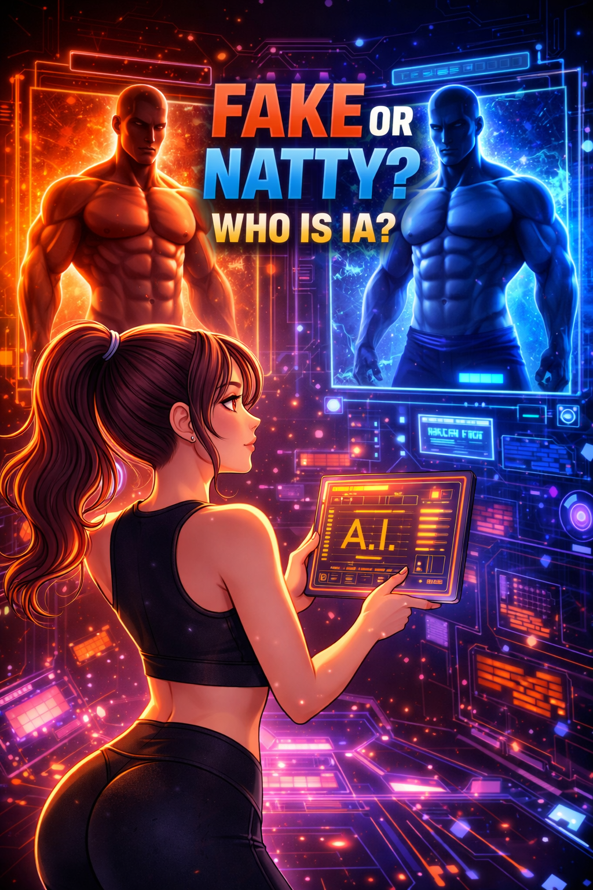

# 🎬 AI Challenge: Real or Artificial?

## 📌 Project Description

This project aims to demonstrate the potential of artificial intelligence in creating realistic videos that simulate everyday human speech.

Two videos were developed using AI-generated avatars and voice, following a storytelling-style script designed to replicate natural communication patterns such as pauses, hesitations, and informal language.

The main idea is to challenge the viewer’s perception:

> Can you tell if this video was created by a real person or by artificial intelligence?

---

## 🎯 Objective

- Explore AI-powered video generation tools  
- Simulate human-like communication  
- Evaluate the realism of current AI technologies  
- Reflect on authenticity and trust in the age of AI  

---

## 🧰 Tools Used

- 🎭 ChatGPT — Script creation  
  🔗 https://chatgpt.com/ 

- 🤖 HeyGen — AI avatar and video generation  
  🔗 https://www.heygen.com  

- 🎬 Vidnoz AI — AI video creation platform  
  🔗 https://pt.vidnoz.com  

- ✂️ CapCut — Video editing and final composition  
  🔗 https://www.capcut.com  

---

## ⚙️ Creation Process

### 🎥 Video 1 — Custom Avatar (HeyGen)

For the first video, a custom avatar was created using a detailed prompt to simulate a realistic Brazilian woman:

> “Brazilian woman from São Paulo, around 27 years old, common appearance, light brown skin, dark brown hair slightly messy or simply tied, light makeup, casual clothing, natural and slightly tired expression, realistic style, soft ambient lighting, everyday look.”

A natural voice was selected and the script was generated in English.  
Portuguese (my native language) was initially tested, but it sounded more robotic, so English was chosen to achieve a more natural and convincing result.

The script was created with the support of ChatGPT and implemented using HeyGen.

---

### 🎥 Video 2 — Prebuilt Avatar (Vidnoz AI)

For the second video, a prebuilt avatar was selected using Vidnoz AI.

A voice was chosen, and the script (also created with ChatGPT support) was added directly to the platform.

This version follows a slightly more structured and polished communication style, creating a subtle contrast with the first video.

---

### ✂️ Final Editing

Both videos were combined and refined using CapCut, where adjustments were made to improve visual framing and enhance realism (such as focusing on the face and minimizing unnatural movements).

---

## 🎥 Watch the video

---

## 🧠 Reflection

Artificial intelligence is becoming increasingly capable of replicating human behavior in a convincing way.

This project highlights how synthetic content can blend into everyday digital interactions, raising important questions:

- Can we still distinguish what is real?  
- How much can we trust what we see?  

---

## 🚀 Conclusion

The evolution of AI tools enables the creation of highly realistic content, expanding creative possibilities while also demanding greater awareness regarding ethical use and content verification.

---

## 👩‍💻 Author

Letícia Guimarães Coelho  
📊 Data Analyst | BI | Power BI | AI Applications  
